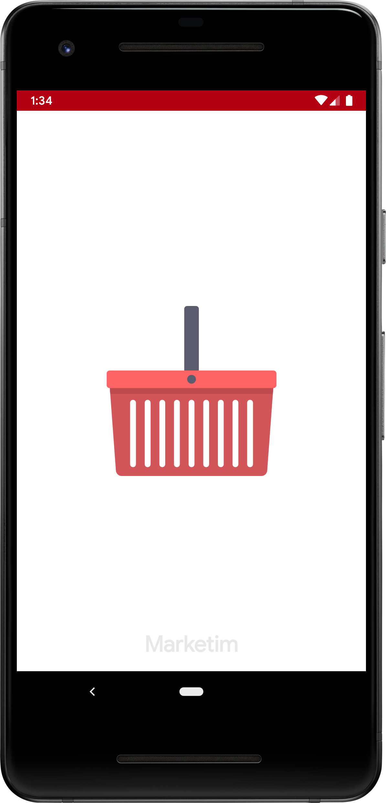
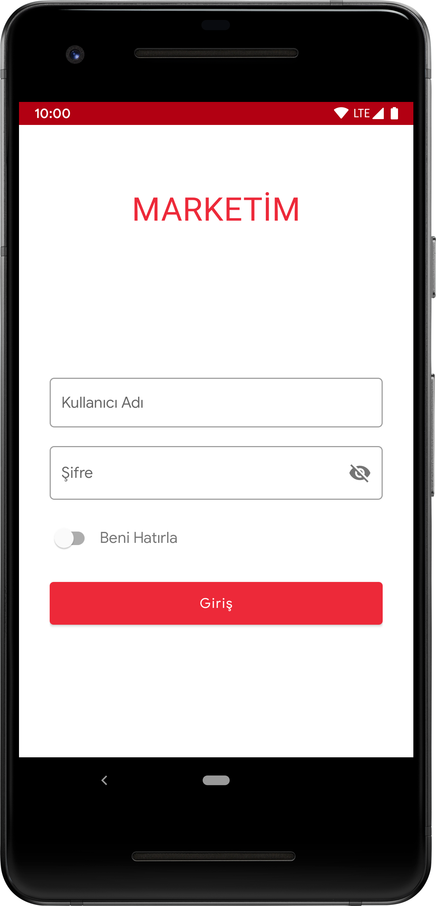
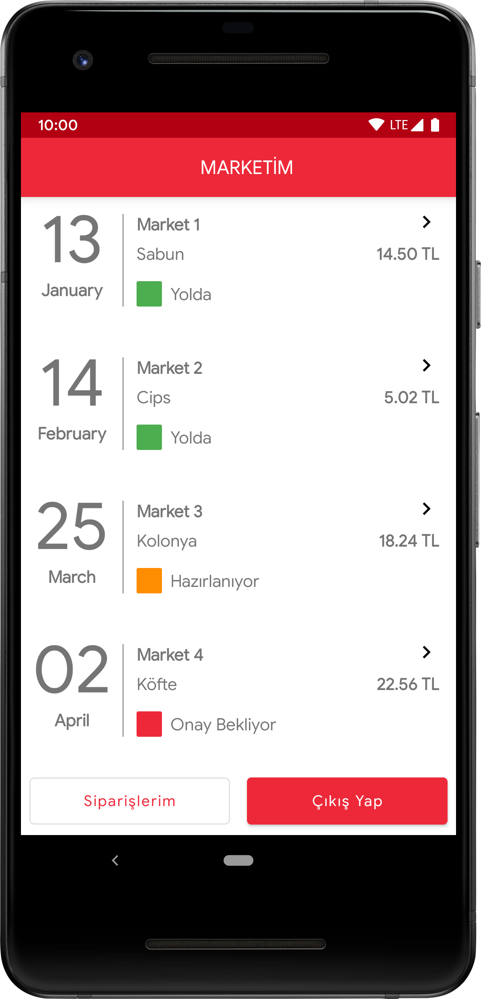
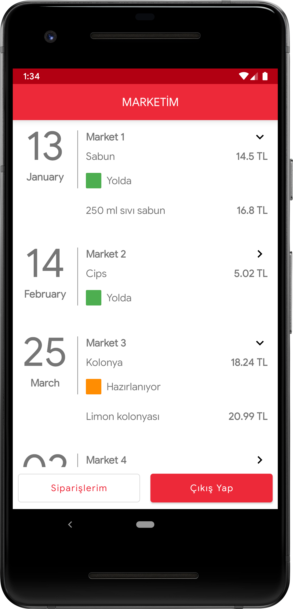

# Marketim

<p align="center"></p>

:boom: ***Marketim*** is a order tracking app that users can view them by logging in. API is provided by [Kariyer.net](https://www.kariyer.net).

<p align="center">
  <a href="https://www.kariyer.net"></a>
</p>

[](https://circleci.com/gh/nuhkoca/market_tech_challenge/tree/master)
[](https://kotlinlang.org)
[](https://android-arsenal.com/api?level=21)

#### About

>The app is fed by Kariyer.net.

>Sensitive Data is secured by the power of NDK.

>The dependency management is managed by buildSrc module.

>[Material Components](https://github.com/material-components/material-components-android) were used for UI.

#### Screenshots


| Splash screen | Login screen | Orders screen | Order with detail screen
|:----------------:|:---------------:|:---------------:|:----------------:
|   |   |  | 


### Architecture
* [Clean Architecture](https://www.amazon.com/Clean-Architecture-Craftsmans-Software-Structure/dp/0134494164)
* [MVVM](https://www.raywenderlich.com/8984-mvvm-on-android)

### Patterns
* [Repository](https://developer.android.com/jetpack/docs/guide)
* [Observer](https://code.tutsplus.com/tutorials/android-design-patterns-the-observer-pattern--cms-28963)

### Approaches
* [SOLID Principle](https://itnext.io/solid-principles-explanation-and-examples-715b975dcad4?gi=79443348411d)
* [Unit Testing](http://softwaretestingfundamentals.com/unit-testing/)

### Technology Stack
* [Kotlin](https://kotlinlang.org/)
* [Kotlin DSL](https://docs.gradle.org/current/userguide/kotlin_dsl.html)
* [Mapbox](https://www.mapbox.com/)
* [Dagger 2](https://github.com/google/dagger)
* [RxJava](https://github.com/ReactiveX/RxJava)
* [Retrofit 2](https://square.github.io/retrofit/)
* [Android Jetpack](https://developer.android.com/jetpack)
  * [LiveData](https://developer.android.com/topic/libraries/architecture/livedata)
  * [ViewModel](https://developer.android.com/topic/libraries/architecture/viewmodel)
  * [ConstraintLayout](https://developer.android.com/training/constraint-layout)
* [Mockito](https://site.mockito.org/)
* [EasyPermissions](https://github.com/googlesamples/easypermissions)
* [Lottie](https://github.com/airbnb/lottie-android)

### License

**App icon based on:**

Icons made by Freepik from [Flaticon](https://www.flaticon.com/) is licensed by CC 3.0 BY

```
MIT License

Copyright (c) 2019 Nuh Koca

Permission is hereby granted, free of charge, to any person obtaining a copy
of this software and associated documentation files (the "Software"), to deal
in the Software without restriction, including without limitation the rights
to use, copy, modify, merge, publish, distribute, sublicense, and/or sell
copies of the Software, and to permit persons to whom the Software is
furnished to do so, subject to the following conditions:

The above copyright notice and this permission notice shall be included in all
copies or substantial portions of the Software.

THE SOFTWARE IS PROVIDED "AS IS", WITHOUT WARRANTY OF ANY KIND, EXPRESS OR
IMPLIED, INCLUDING BUT NOT LIMITED TO THE WARRANTIES OF MERCHANTABILITY,
FITNESS FOR A PARTICULAR PURPOSE AND NONINFRINGEMENT. IN NO EVENT SHALL THE
AUTHORS OR COPYRIGHT HOLDERS BE LIABLE FOR ANY CLAIM, DAMAGES OR OTHER
LIABILITY, WHETHER IN AN ACTION OF CONTRACT, TORT OR OTHERWISE, ARISING FROM,
OUT OF OR IN CONNECTION WITH THE SOFTWARE OR THE USE OR OTHER DEALINGS IN THE
SOFTWARE.
```